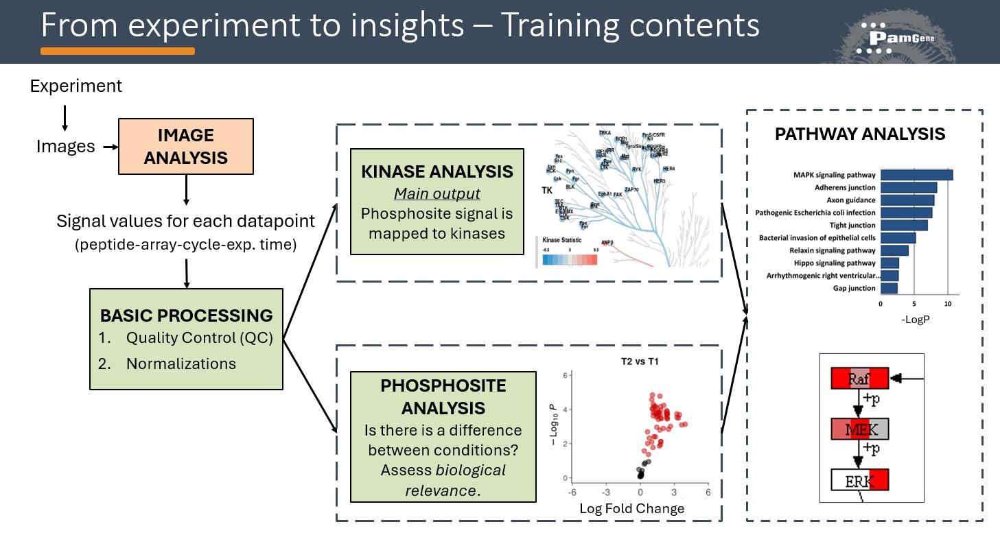
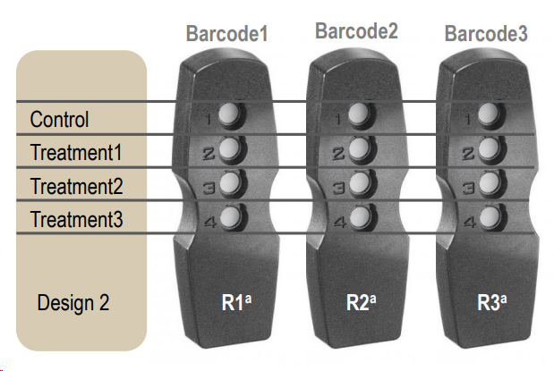
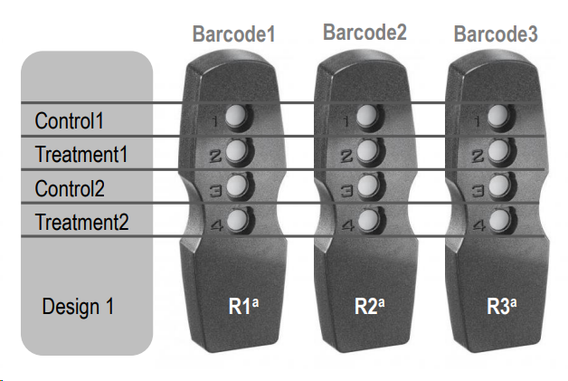
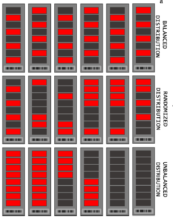
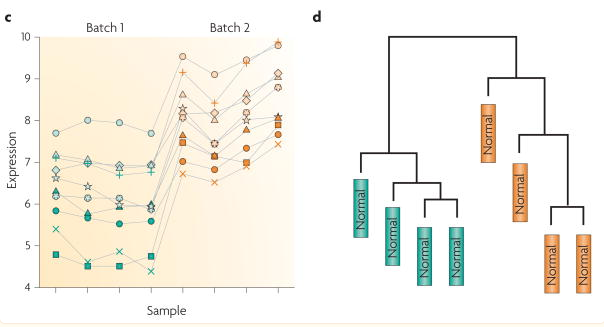
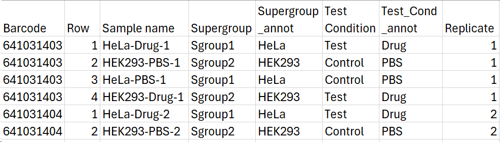
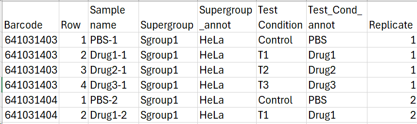

## Prerequisites

Complete this training after watching (and optionally working through) the general Tercen tutorial. You should already know:

- How Tercen is organized (Teams, Projects, clone, upload, download from project page)
- What workflows are
- How to upload data tables
- How a workflow step crosstab view looks
- Row factors, column factors, y and x factors
- How to use filters and Boolean logic
- How to use colors
- Data visualizations: points / heatmap / bar
- Operators: input projection, output relations, run and reset, namespace, README
- Special steps: join, gather, export (short and long format)

---

## Overview

---
# Part 1: Experiment Design & Image Analysis

---

## Experiment Design

### Two Basic Experiment Designs

| Design | Description |
|--------|-------------|
| **C-T1T2T3** | Compare multiple Test conditions vs one Control |
| **C1T1–C2T2** | Compare 2 model systems, each with its own Test and Control |

**Number of replicates needed:**
- Cell lines: minimum **3 replicates / condition**
- Primary cell culture: minimum **6 replicates / condition**

---

### Balanced Design

Batch effects are variations caused by technical variability due to time, place, and materials  (e.g. runs, PamChips). Batch effects can confound real effects if the design is unbalanced → false results.

A **balanced design** avoids confounding the effects of the covariates of interest with batch effects. 

If needed, correction for batch effects is possible.

**Reference:** [Leek et al., 2010]

---

### How to Make Sample Annotation

An experiment needs the following design elements:

- **Test condition**: describes what to compare (e.g. treated vs untreated, mutated vs wild type). For multiple test conditions with 1 control → use C-T1-2-3 design.
- **Supergroup**: the group within which you compare T vs C (e.g. tissue). For 2 supergroups with 1 T and 1 C → use C1T1-C2T2 design.
- **Sample name**: should be unique to the sample (e.g. Barcode + Row). Suggested format: `<Supergroup>_<TestCond>_<Replicate>`

Add additional columns if needed (e.g. date, run).

---

### Naming Rules for Workflow Automation

- Have `Supergroup` and `Test Condition` columns with **unchanged column names and values** (e.g. Control, T1, T2). Case sensitivity matters.
- Real names go in separate columns (e.g. `Supergroup_annot`, `Tissue`)
- Have a `Supergroup` column **even if there is only 1 supergroup** — needed for UKA
- `Sample name` must be **unique per biological replicate** (e.g. `HeLa_Control_1`) — needed for UKA
- `Replicate` column: only necessary in some designs for fold change calculation
- Keep names simple → visible on heatmaps
