## Tercen Structure 

### Teams > Projects

Access is determined at Team level (Teams can be shared with other members). Own Team is for personal use.

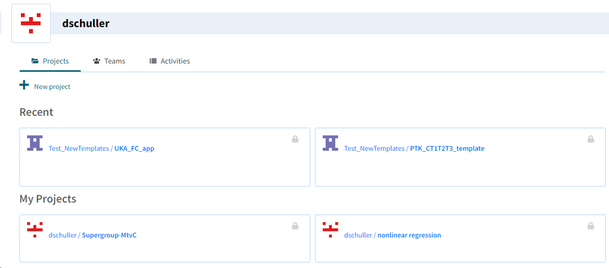

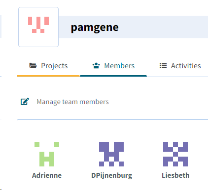

---

### Upload Data to a Project

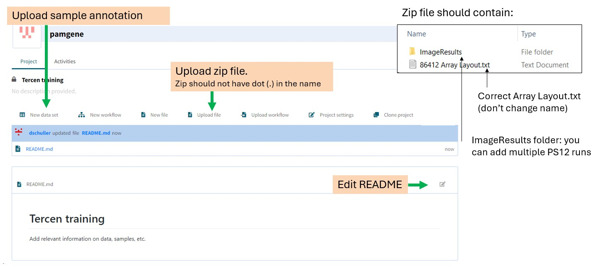

The zip file to upload should contain:
- `ImageResults/` folder (can contain multiple PS12 runs)
- `Array Layout.txt` (correct file, do not change name)
- Zip file name must **not contain a dot (.)**

---

#### Uploading Sample Annotation: Set Column Types

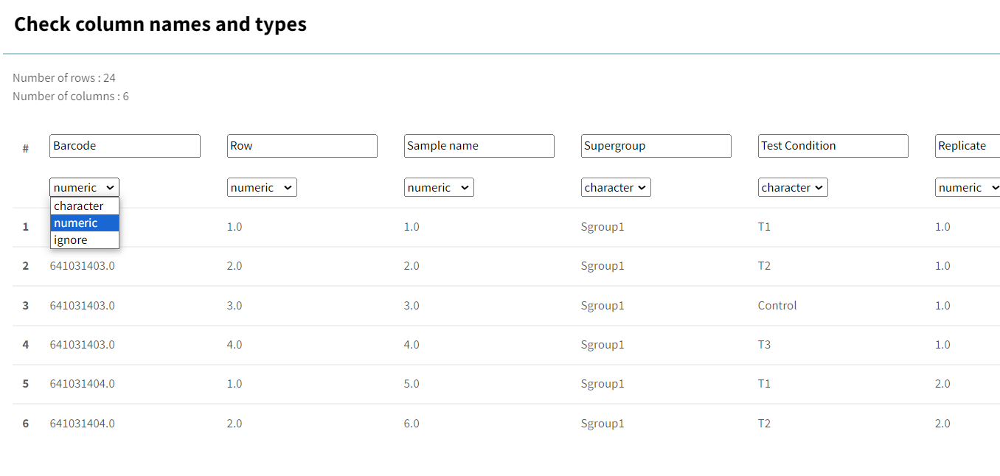

- **Barcode** is numeric by default → must be set to **character** to join with IA output
- Check all other columns too — MS Excel sometimes changes column types
- If Sample name is a number, change it to character (numeric columns are used as y-axis factors)

---

### Add New Image analysis template
New worfklow → search for image_analysis templates. 
You can rename the template - useful if multiple of the same type exist in a project.

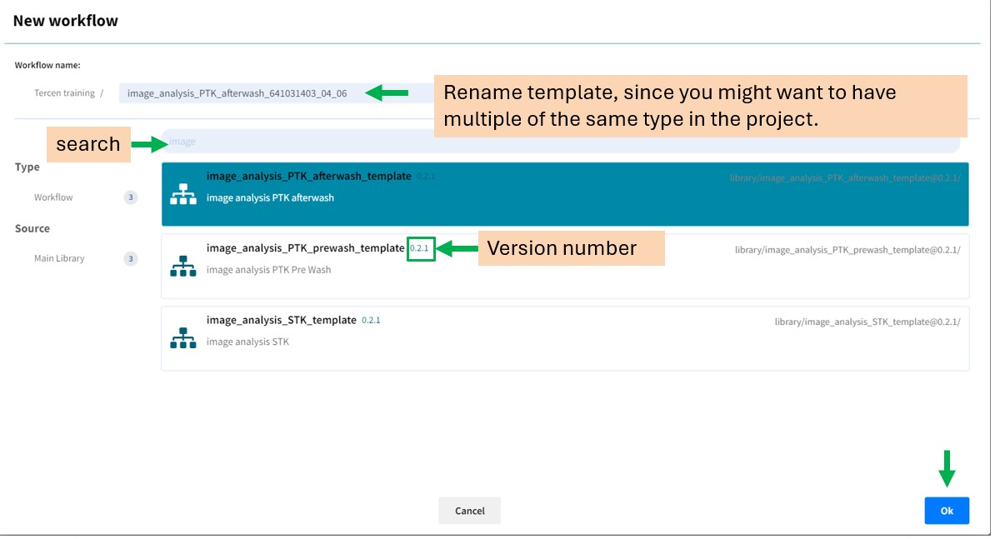
### Image Analysis Overview - part 1.

A template contains different types of steps (indicated by icon in top left corner), e.g. 
* data upload step,
* operator, which changes the input data and produces an output. 

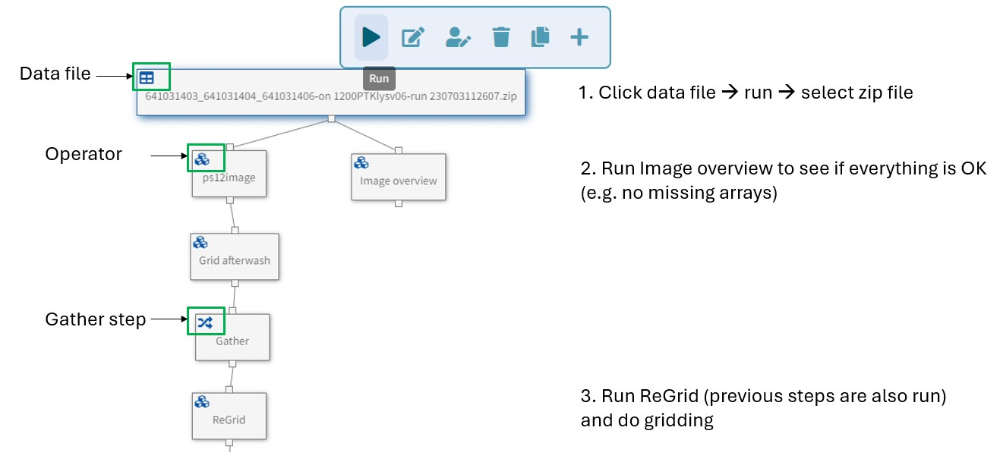

Overview of steps (details below)
1. Click data file → Run → select zip file
2. Run **Image overview** to see if everything is OK (see below)
3. Run **ReGrid** (previous steps run automatically) and do gridding 

---
### Image Overview

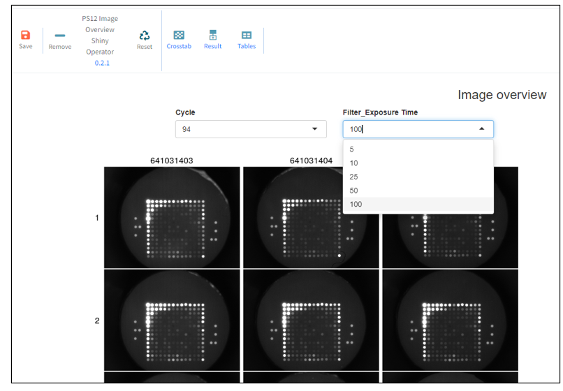
The Image overview is run by a **Shiny operator** (reactive — expects user interaction). Shiny operators are computation-intensive; if no interaction occurs, the operator stops (turns grey) after ~30 seconds.
Grey appearance means that the shiny operator has stopped. → just restart it.

Look at the image overview **afterwash** to see if there is anything concerning:

- Shadow
- Blurry arrays
- **Bubble** → in most cases still usable
- **Broken arrays** → must be discarded

If there is something concerning, look at prewash in the same image overview. If the issues are not present there, in the data analysis template, change the cycle number for afterwash (e.g. from 94 to 92 for PTK; in STK from 124 to 122 or earlier). Change it in all apps up to and including the QC_PTK / QC_STK step where there is a filter.

Stopping the PTK or STK experiment run and rerunning it causes a difference in cycle numbers. In IA, **filters must be adjusted in Grid, Regrid, and Select steps**. Filters are saved in workflows and can be brought into later steps ("Clone Project Filter").

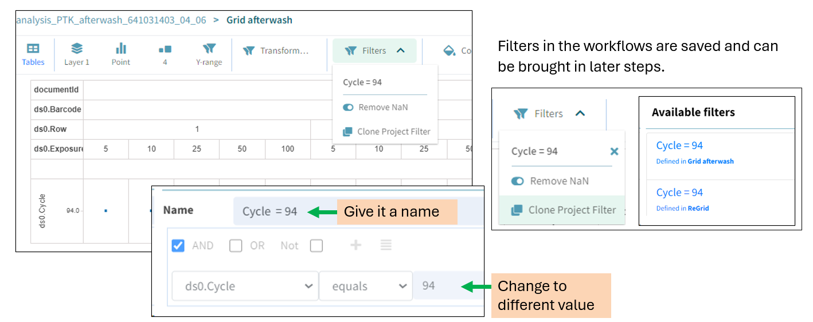

---
#### Examples of issues
Bubble on the side (still usable)
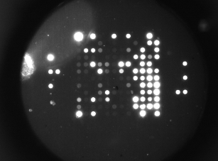
Broken array → discard 
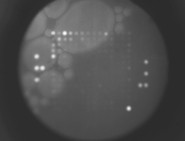

---

### Special Peptides on the Array Layouts

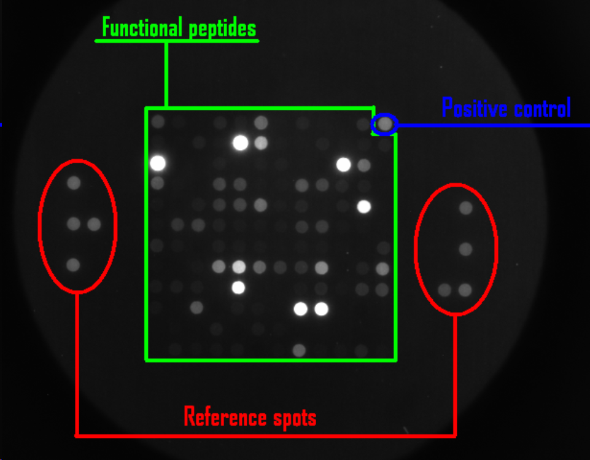

| Type                 | Description                                                                                                  | Peptide names                   |
| -------------------- | ------------------------------------------------------------------------------------------------------------ | ------------------------------- |
| **REF**              | Grid reference spots (8): fluorescent peptides on sides of PamChip, help gridding                            | —                               |
| **Positive control** | Pre-phosphorylated peptides; check performance of detection system (e.g. antibody). Expectation: S100 > 1000 | PTK: ART_003; STK: pVASP, pTY3H |
| **Negative control** | No phosphosite (Y, S, or T)                                                                                  | PTK: EFS_246_258_Y253F          |
| **ART_004**          | Non-prephosphorylated counterpart of ART_003 (PTK) — artificial but phosphorylated by multiple kinases       | Similar: ART_025 (STK)          |

> **Note:** If a sample shows overall lower intensity, check the positive control. High signal in prephosphorylated peptides = enough antibody → lower intensity is biological. Low signal in prephosphorylated peptides = technical problem (insufficient antibody).

### Gridding

The purpose of gridding is to find incorrectly placed grids and manually correct them.

> ⚠️ Gridding is done by a Shiny operator. **Always finish it and do not leave the page** — if it stops, all reviewed grids are lost!

---

### Image Analysis Overview — Part 2

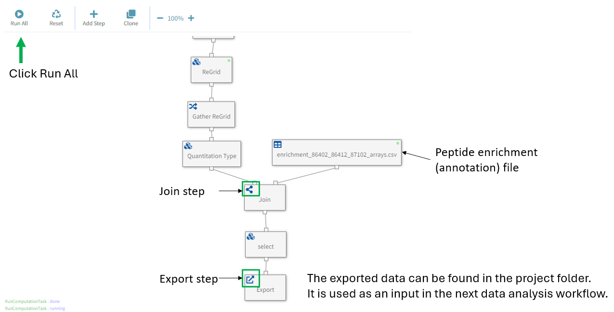

Just **click Run All**.
- The **Join** step merges the IA output with the peptide enrichment (annotation) file
- The **Export** step: exported data is saved in the project folder and used as input for the next workflow

---

### The Peptide Enrichment File and the Join Step

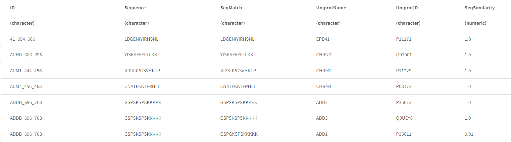

Each peptide sequence has 1 or more BLAST matches to a target protein with a `SeqSimilarity` value. `UniprotName` is the primary gene name (unique). Protein matches to peptides are not directly used in downstream data analysis but can be used to make hypotheses about which proteins could have been phosphorylated in the sample. 
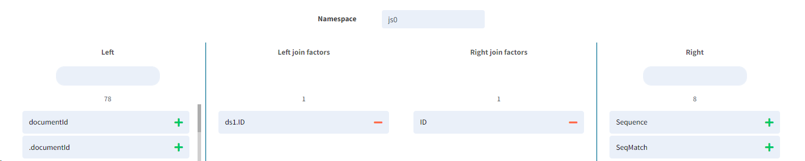

The **Join** step combines two datasets using a common key column (here: `ID`). The resulting table contains all factors (columns, rows and values) from both datasets.