We have run the image analysis workflow.
Its output file contains:
- Median_SigmBg per peptide-barcode-row-cycle-exposure time
- Peptide annotation (Sequence, SwissProtID, gene name, sequence similarity)

Next, add the PTK_template or STK_template to do the data analysis using the output file of the image analysis.
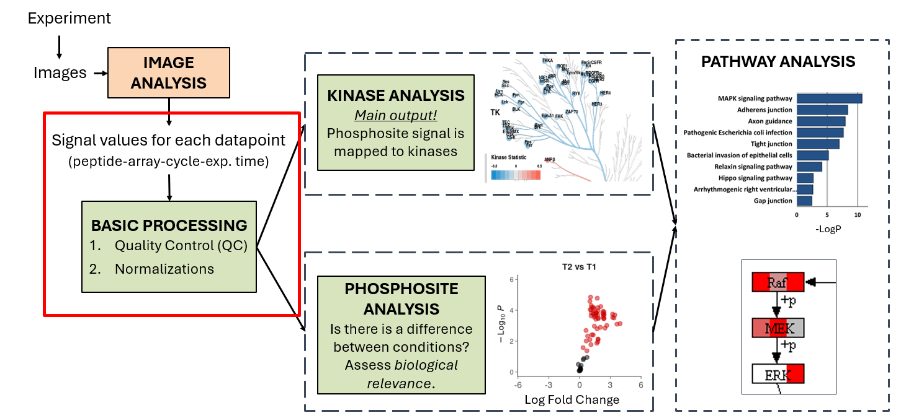

## Basic Processing Overview

The result of Image Analysis contains the **Median signal minus background (Median_SigmBg)** value for each peptide-barcode-row-cycle-exposure time datapoint.

1. data step: add image analysis output files (for PTK: add both **prewash** and **afterwash** at the same time)
2. Join with sample annotation
3. Run **ETS** (Exposure Time Scaling) app.
   ETS combines Median_SigmBg at multiple exposure times to create a single value per cycle: **S100** (AU).
4. Check Mean and CV (CV is the data quality metric)
5. Check positive control (pre-phosphorylated peptides). Expectation: **S100 > 1000**
6. Run the QC app (PTK or STK QC app)
---

## ETS: Exposure Time Scaling App

The ETS is the first app in PamGene data analysis. An **app** is a subworkflow: left click "Open" to inspect the structure to familiarize yourself with how an app looks like in general. It always starts with an *Input step*, which takes the data from the main workflow. Then there is a *wizard step* which helps the users to select data. Then there are data transformation steps and finally:
- *View step(s)* to visualize data
- *Output step* to bring data back to the main workflow

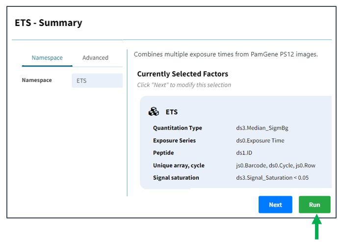

However, usually we do not have to interact with the app from inside. When we run the app from the main workflow, the *wizard* pops up, where we have to select correct data input by answering questions.  

In ETS, the correct factors are set by default — just click Run.

## Sample quality control: the Mean & CV operator

We examine the sample quality by assessing the variance in the individual conditions / samples. Each condition has usually 3+ biological or techncial replicates. An example of technical replicate is 1 sample lysate on 3+ arrays; An example of biological replicate is 1 sample lysate per array).

**How to configure the crosstab view**
- Each column should contain all replicates of a condition.
- Colors should be set per condition (e.g. drag and drop Supergroup and/or Test condition to colors)

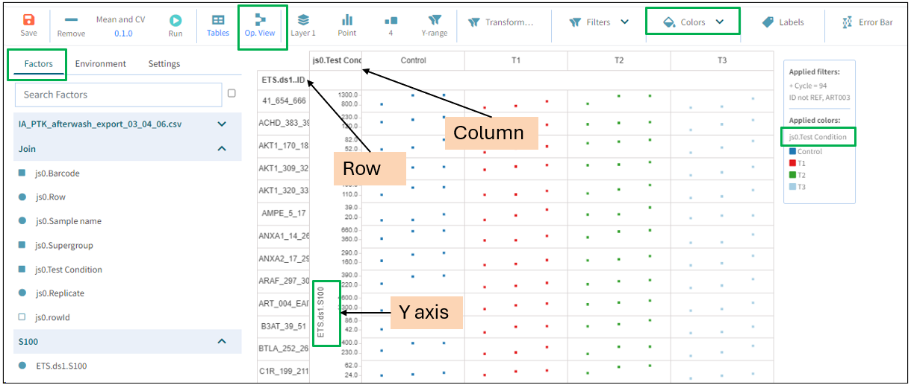

**Running the operator switches to operator view; you can switch back to crosstab view.**

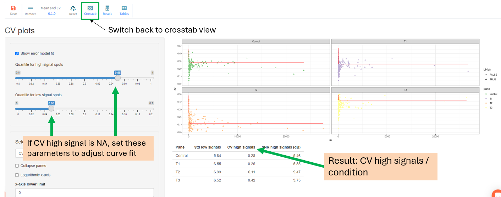
- If CV for high signals is NA → adjust the curve fit parameters shown in the panel
- Result: CV high signals per condition. To interpret results (whether the variation is high or low), use the quality control criteria table below.

---
## QC Apps 

QC apps calculate which peptides have low signal. Phosphorylation on these peptides is not detected, and these peptides should be removed. Peptide removal does not happen inside the app - it will be removed at a later step.

### PTK QC app
- 1. calculates `presence` value per peptide-array: positive if peptide signal shows positive trend over cycles
- 2. Calculates `fractionPresent`: the fraction of arrays with a positive trend per peptide.
- 3. At a later step, the `fractionPresent` factor is used to remove peptides which are only present in a fraction of all the samples (default: 25% which can be lowered.)

Run the app and view the visualization to assess peptide presence:

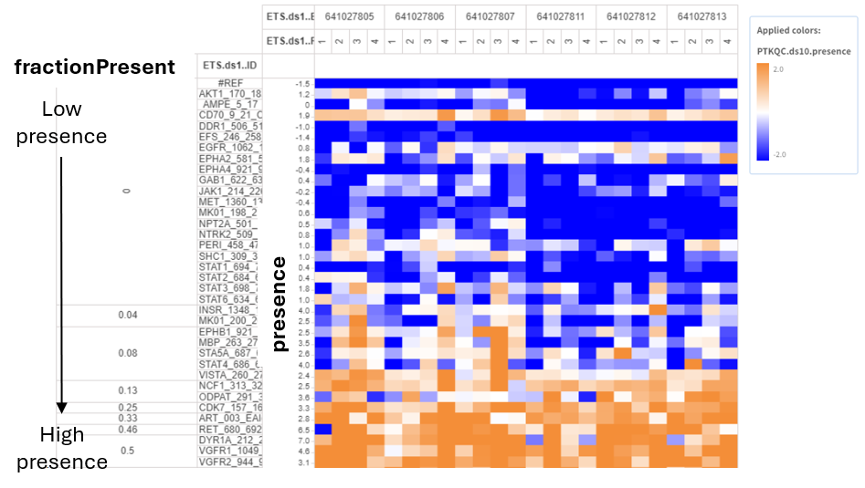

### STK QC LOD app
* This app calculates the same factors as the PTK QC, but in a different way. The reason is that the prewash steps cannot be used in the STK assay to assess the trend over the cycles.
- `Presence` is calculated based on the Limit of Detection (LOD). Peptides with S100 above the LOD are considered **present**.
- Per peptide, the ratio of samples that are present is calculated in the `qc_stk_thr.ratio` factor.

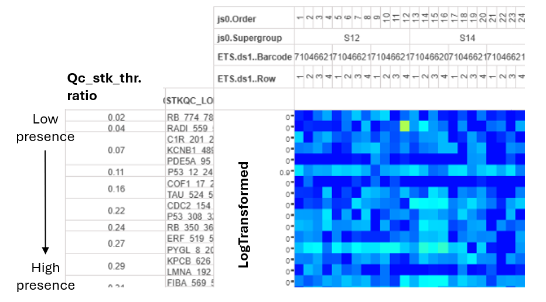

Next, at the first normalization, the peptides which are present in **< 25%** of samples are excluded. 25% is the default threshold but it should be always checked and adjusted. 
25% stems from the following rational: If there are 4 conditions, 25% = 1 condition. It is usually acceptable if peptides are missing in max 1 condition. 

**Always review this threshold during analysis!** Sometimes, we can accept lower threshold, e.g. if there are not enough peptides passing QC or with potent inhibitors which inhibit kinases so that signal is only present in the control sample.

### STK QC App: Use When All Peptides Pass the LOD App

If pre-phosphorylated peptides have very low signal, all peptides will pass the STK_QC_LOD app. In this case, use the **STK_QC app** (based on CV).

- Calculates nominal CV
- At normalization, remove peptides with high CV (= low signal). Use the `pep.cv.estimate` factor. The default threshold is < 0.5, but revise this.

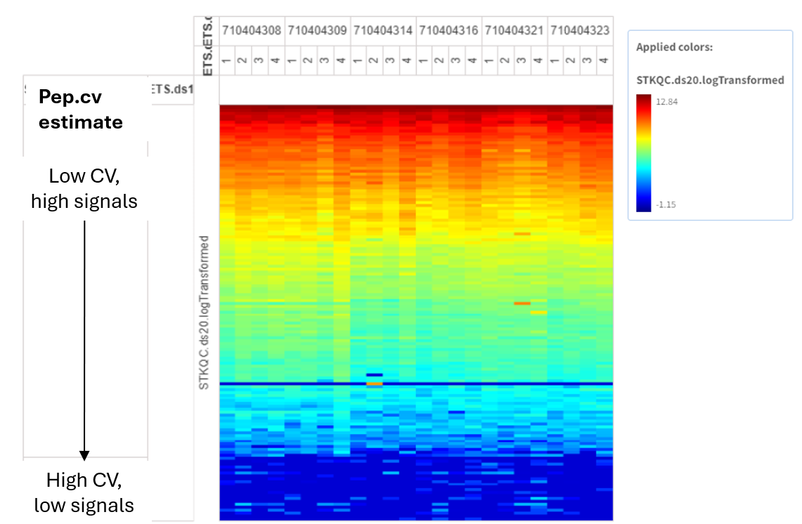

### Removal of low signal peptides

Removal of low signal peptides is done by a Filter in the log step or, if VSN normalization is done, then in the Filter QC peptides step after VSN.
These filters are set up with the defaults in the templates. The QC heatmaps should be used to visually assess if these thresholds should be adjusted.

## Quality Control criteria table

The following criteria can be used to assess quality of the experiment. The quality control does not serve to exclude samples - it rather manages our expectations. For example, if the number of QC passed phosphosites is high and the samples have low biological CV, we can expect that there is a differential signal between conditions. On the contrary, if the flags indicate fair or poor sample quality, probably differential effects won't be highly significant . 

| Level | Flag | Number of QC-passed phosphosites PTK (of 195) | Number of QC-passed phosphosites STK (of 142) | Technical CV | Biological CV |
| ----- | ---- | --------------------------------------------- | --------------------------------------------- | ------------ | ------------- |
| Good  | 🟢   | > 123                                         | > 90                                          | < 20%        | < 30%         |
| Fair  | 🟡   | 78–123                                        | 56–90                                         | 20–30%       | 30–40%        |
| Poor  | 🔴   | < 78                                          | < 56                                          | > 30%        | > 40%         |

---

## Normalizations

Two basic normalizations:
- **Log** (default), or
- **VSN**: Variance Stabilizing Normalization

Optional: **ComBat** batch correction — if needed for UKA, applied after Log or VSN.

> Note: Log normalization & filtering for QC-passed peptides is done in 1 step. For VSN, first VSN is done without filtering, then filtering for QC peptides in the next step. The reason is that log works per individual value, while VSN considers all peptides simultaneously - even peptides not passing QC are needed to carry it out.

---

### Log normalization (Log of QC Peptides) 

* Filter for peptides that passed QC. Defaults:
	* PTK: `fractionPresent > 0.249`
	* STK: `qc_stk_thr.ratio > 0.25`
* The log_cutoff operator assignes 1 to values < 1 before log transformation.

---
### Data flow

In general the data flows in the following way. An operator transforms the data (e.g. log transform). It creates an output factor. Each step has a namespace which is the name of the step. 

Output construction follows the pattern: `<namespace>.<output_name_from_operator>`

In the next step, the output of the previous step is taken as input values. It is represented on the y axis of the crosstab view.

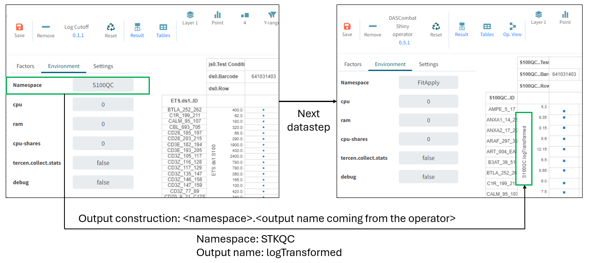

Example:
- Namespace: `STKQC`
- Output name: `logTransformed`
- → Full reference: `STKQC.logTransformed`

---

### VSN normalization

In log data, low-signal peptides have higher variance. The same fold change of a low-mean peptide is less significant than for a high-mean peptide.

**VSN** counteracts this by making variance independent of the mean → facilitates discovery of significant phosphosites with low signals.

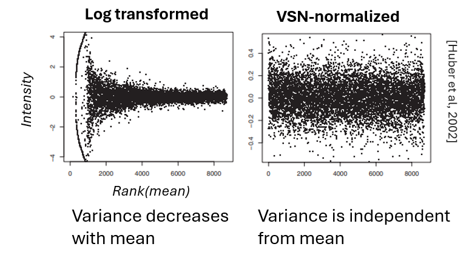

**When to use VSN:** data shows low signal or noise.

#### **VSN reveals relative differences compared to the data mean, not absolute differences.**

**VSN in detail:**
1. Centers data to the mean and scales the data.
2. Log transformation → VSN result is equivalent to log transformation

→ Due to the data centering, the interpretation changes!

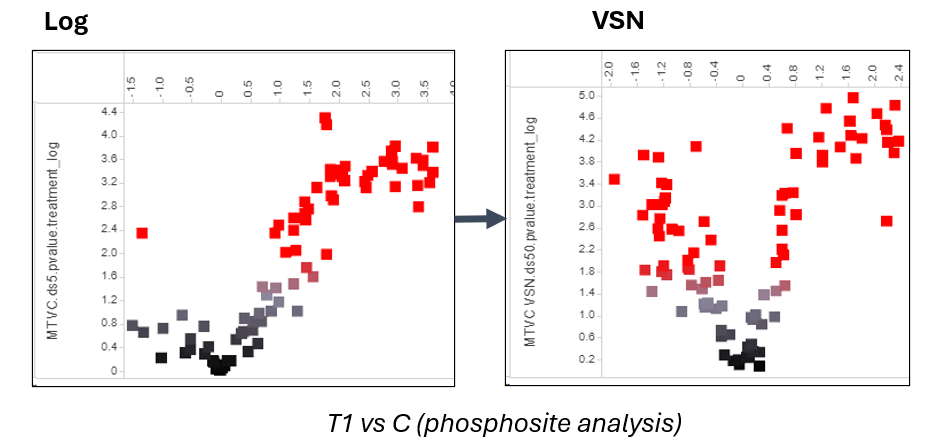

If with log data, we observe general upregulation of phosphosites in T vs C at phosphosite analysis, after VSN there will probably be down and upregulation as well. The interpretation: the absolute changes are positive, but the negative signals are the ones which have relatively lower signals compared to the mean of all samples. 

### Log or VSN?

As default we do log transformation, since VSN transforms the data in a way that fold change directions are harder to interpret. 

**Scenario 1, when VSN can be better than log: when there is significant differential signal only with VSN.** 

After log2, if there is no differential signal between Test and Control conditions, and especially when the signal is overall low, VSN could work better. The reason can be the presence of differential low signal peptides which have a greater chance to be significant in VSN than in log2 data. 

If there are more significant phosphosites or kinases after VSN than log2, and / or conditions cluster better in PCA, we can conclude that VSN works better for the given data. 

*Interpretation*: the kinase directions (fold changes) are relative to the data mean.

**Scenario 2: Log data results in a global up or down shift of kinases, but other experiments have shown that some kinases show the opposite pattern.** 

An example:

1. we observe global upregulation with log
2. we don’t trust this because some kinases should show the opposite pattern. We can set the hypothesis: there is an overactive kinase family which masks the real effects, meaning that we can’t detect downregulated kinases.
3. VSN results in kinases that are down relative to the mean.
4. Can we interpret this as downregulated kinases in the sample? → Assess:
	1. whether downregulated kinases follow expectations: e.g. they map to a specific pathways.
	2. Whether downregulated kinases have a high specificity score. 

*Interpretation*:
- VSN shows kinase changes relative to the data mean.
- If kinases follow expectations and they have a high specificity score, probably the hypothesis was correct. We can consider downregulated kinases as probably downregulated in the sample.
- However, if downregulated kinases are scattered and have low specificity score, we must conclude that this was just a normalization artifact. We must think of other hypotheses why PamGene experiments resulted in global upregulation.

---

### ComBat: Batch Effect Correction

1. **Crosstab view**: color by expected technical batch (Barcode for single PS12 run; Run for multi-run projects)
2. **Operator view**: assess batch effect removal — check if before-ComBat PCA shows batch clusters and after-ComBat PCA has resolved them
3. If resolved, click **Done** — leave the page **only when the dot appears under Done**

#### Check PCA and Heatmap Before and After ComBat

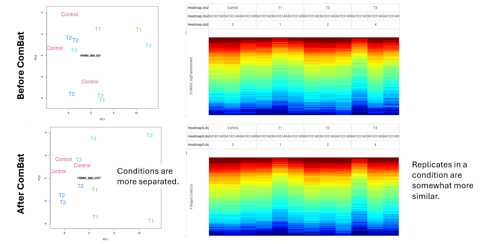

After ComBat:
- Replicates within a condition are usually more similar
- Conditions are usually more separated

**Important: for multi-run experiments**: check Run effect first (usually larger than Barcode). Correcting for too many batch types can introduce bias — if Run effect exists, correcting for Barcode as well is usually unnecessary.

---

## References

**VSN:**
- Huber, W., et al. (2002). Variance stabilization applied to microarray data calibration and to the quantification of differential expression. *Bioinformatics*, 18(S1), S96–S104.

**ComBat and batch correction:**
- Chen, C., et al. (2011). Removing batch effects in analysis of expression microarray data: An evaluation of six batch adjustment methods. *PLoS One*, 6, e17238.
- Johnson, W.E., Li, C. & Rabinovic, A. (2007). Adjusting batch effects in microarray expression data using empirical Bayes methods. *Biostatistics*, 8, 118–127.
- Leek, J.T., et al. (2010). Tackling the widespread and critical impact of batch effects in high-throughput data. *Nature Reviews Genetics*, 11(10), 733–739.
- Zindler, T., et al. (2020). Simulating ComBat: how batch correction can lead to the systematic introduction of false positive results in DNA methylation microarray studies. *BMC Bioinformatics*, 21(1), 1–15.
