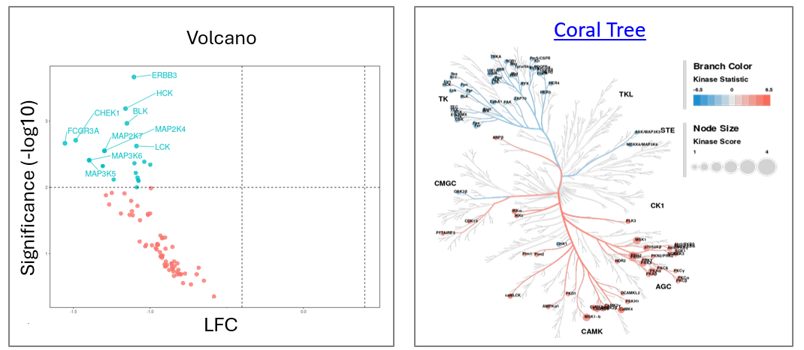
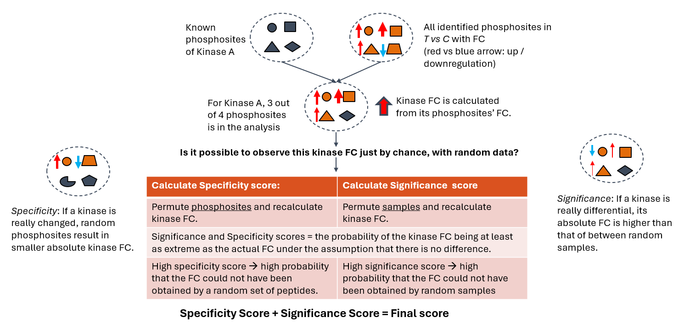
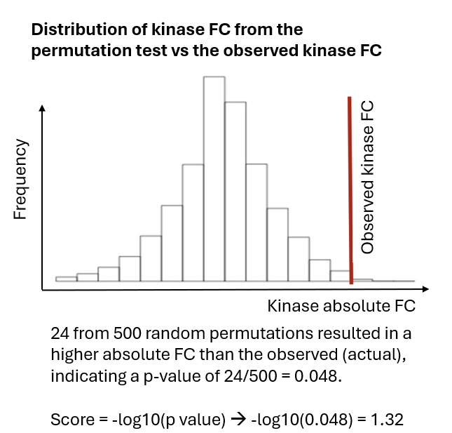

## Introduction to Upstream Kinase Analysis 

Kinase prediction (Upstream Kinase Analysis, UKA) is the main output of PamGene analysis.

The UKA relies on public databases of kinase–to–phosphosite relationships.

UKA is a **functional class scoring method**: it predicts kinase activity by analyzing changes in the sets of phosphosites belonging to each kinase.* Scores indicate how strongly a kinase is associated with the observed changes in peptide signal.

The UKA is run on **all peptides after QC** — not only significant peptides.

**Output**: kinases changed between two conditions (T vs C): **LFC & Significance**



*\* Another functional class scoring method is GSEA, Gene Set Enrichment Analysis. For GSEA, a pathway is considered a functional class of members - in UKA, a kinase is considered as a functional class of phosphosites.

---

## The UKA Algorithm in a Nutshell



1. Calculate **Kinase FC** from the FCs of its phosphosites.
2. **Significance score**: permute samples 500 times and recalculate kinase FC. This gives the probability that the observed kinase FC could not have been obtained from random samples. This tells: _“Is this kinase signal reliably different?”_
3. **Specificity score**: permute phosphosites and recalculate kinase FC. This gives the probability that the observed FC could not have been obtained from a random peptide set. This tells: _“Is this kinase specifically responsible for these phosphorylation changes?”
4. **Final score** = Significance Score + Specificity Score

| Score            | Permutation  | High score means                                                                                                  | Comments                                                                                                                                                                                                                                                                                                                                                                                                                                |
| ---------------- | ------------ | ----------------------------------------------------------------------------------------------------------------- | --------------------------------------------------------------------------------------------------------------------------------------------------------------------------------------------------------------------------------------------------------------------------------------------------------------------------------------------------------------------------------------------------------------------------------------- |
| **Significance** | Samples      | High probability kinase FC is real (not due to sample noise)                                                      | Can be biased toward **promiscuous kinases** or abundant activity. With a limited number of replicates (such as n=3), the statistical power is relatively low, which can make the significance score less robust and more prone to variability. In addition, it tends to favour kinases that act on many substrates. These “hub” kinases (like MAPKs or CDKs) often rank highly simply because they affect a large number of peptides.. |
| **Specificity**  | Phosphosites | High probability kinase FC is not due to a random peptide set. Accounts for overlap of substrates between kinases | This is the most important score. It helps identify kinases whose activity is more likely to _specifically explain_ the data, rather than those that are broadly active.                                                                                                                                                                                                                                                                |

**Permutation Test Results**



----
### The UKA Table

**Most important columns:**

| Test Condition | Kinase Name | Median Kinase Statistic | Mean Significance Score | Mean Specificity Score | Median Final Score |
|---|---|---|---|---|---|
| T1 | ROR1 | 1.06 | 0.97 | 1.34 | 2.31 |
| T1 | MAP2K3 | 0.77 | 0.52 | 1.01 | 1.53 |
| T1 | MAP2K6 | 0.77 | 0.52 | 1.01 | 1.53 |

**Additional columns:**

| Kinase Name | Median Kinase Change | Mean Peptide Set Size |
| ----------- | -------------------- | --------------------- |
| ROR1        | 0.25                 | 3                     |
| MAP2K3      | 0.34                 | 5                     |

**Usage notes:**
- Use **Median Kinase Statistic** as a proxy for LFC between T vs C. < 0 = inhibition, > 0 = activation.
	- The Kinase statistic is signal-to-noise ratio: the LFC scaled by noise. This is more relevant than simple LFC for predicted data.
- **Median Kinase Change** is the actual LFC
- Kinases with **small peptide sets** are usually more specific
- For stricter thresholds: set a cutoff on **Specificity Score**
- Scores are Mean or Median because the algorithm considers multiple peptide sets per kinase (of varying size based on interaction strength). See `uka_description.pdf` for details.

---
### UKA Scores — Detailed Definitions

| Score                                 | Definition                                                                                                                                                                         |
| ------------------------------------- | ---------------------------------------------------------------------------------------------------------------------------------------------------------------------------------- |
| **Kinase Statistic**                  | Direction of effect: change in kinase activity in T vs C. <br>Calculated as the median of Peptide Statistics (signal-to-noise ratio between T and C) of the kinase's peptide set.  |
| **Significance Score**                | Based on a sample-permutation test. High score = high probability of differential activity between T and C.                                                                        |
| **Specificity Score**                 | Based on a peptide-permutation test. High score = high probability the effect was not obtained by a random peptide set.                                                            |
| **Kinase Score (Median Final Score)** | Significance Score + Specificity Score                                                                                                                                             |

## Batch Correction for UKA?

In UKA, there is **no pairing option** available.

ComBat should only be done for UKA (or PCA, class prediction) **if:**
1. The design is **balanced** (conditions balanced over technical batches)
2. There is a batch effect **and** ComBat can remove it

If ComBat cannot remove the batch effect → UKA on log/VSN data.

```
Is there batch effect?
│
├── Yes → ComBat → UKA on log/VSN + ComBat-corrected data
│
└── No  → UKA on log/VSN data
```

