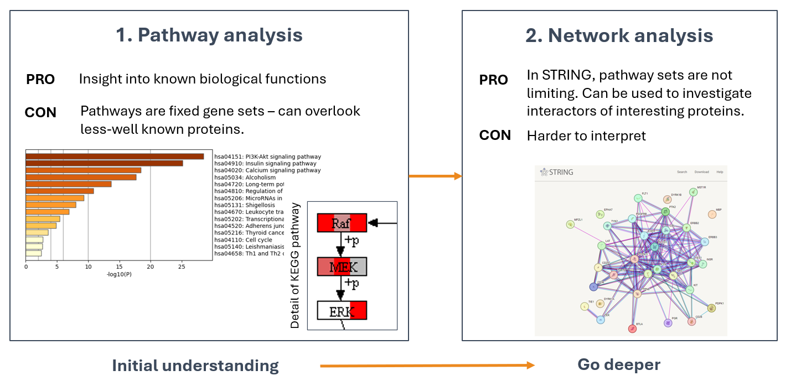
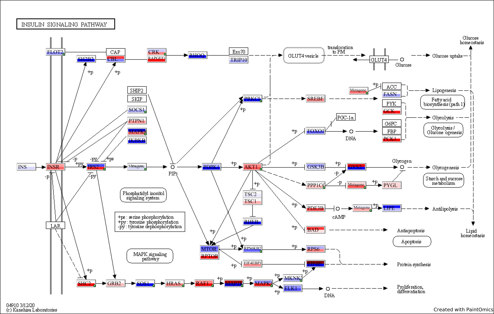
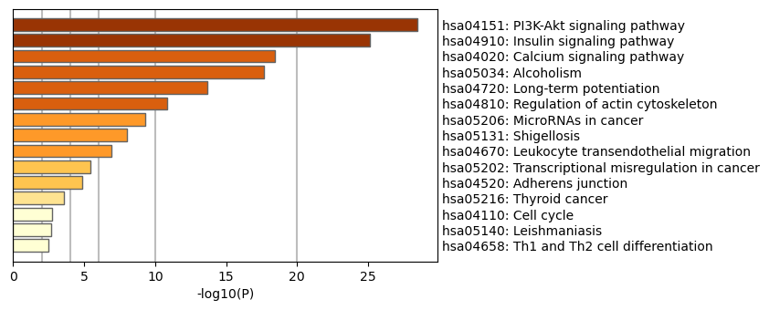

## The interpretation of PamGene Data

|                | Phosphosite data                                                                                                                           | Kinase data                                                                                       |
| -------------- | ------------------------------------------------------------------------------------------------------------------------------------------ | ------------------------------------------------------------------------------------------------- |
| **Key caveat** | - Protein may not be present in lysate. - Phosphorylation → different outcomes (induction or inhibition of protein or other functions). | Predicted values → pre-select kinases with high scores (specificity score minimally > 0.7 or > 1) |
| **Strength**   | Autophosphorylation sites are valuable.                                                                                                    | Easy interpretation: positive FC = activation, negative = inhibition.                             |

**Example: Phosphosites with different functions:**

| ID           | PSite | Residue | Function                                                |
| ------------ | ----- | ------- | ------------------------------------------------------- |
| AKT1_301_313 | 308   | T       | required for full activity                              |
| AKT1_170_182 | 176   | Y       | phosphorylation by TNK2 tethers AKT1 to plasma membrane |

---

## Pathway and Network Analysis Are Complementary

---

## Pathway Analysis Tools

**Choose:**
- Pathway sets (e.g. KEGG, Reactome, WikiPathways, GO)
- Type of analysis:
	- Functional Class Scoring (e.g. GSEA)
	- Overrepresentation Analysis (e.g. EnrichR)

Pathway analysis types

| Overrepresentation (e.g. Metascape)                                                                                                                                                                     | Functional class scoring (e.g. GSEA)                                                                                                                                                            |
| ------------------------------------------------------------------------------------------------------------------------------------------------------------------------------------------------------- | ----------------------------------------------------------------------------------------------------------------------------------------------------------------------------------------------- |
| TLDR: More true positive, more false positive results.  Tests whether the overlap of pathway members in the data is higher than by chance.  Input: list of significant features (no values) | TLDR: Less false positive, less true positive results.  Detects pathways based on subtle, coordinated changes in pathway members.  Input: actual values of features or Fold Change. |
| Pro: easy to use.                                                                                                                                                                                       | Pro: Can sensitively detect subtle, coordinated changes in pathway members. Pathway output is more reliable.                                                                                    |
| Con: Pre-filtering of features can introduce bias: 1) subtler changes might not be significant; 2) multiple testing bias (inflation of false positives)                                                 | Con: Can overlook pathways if members don’t show clear up-or downregulation.                                                                                                                    |

**Online tools:** Metascape, EnrichR, gProfiler, Paintomics (overrepresentation analysis)

**R packages:** GSEA (gage, clusterProfiler), Pathview

**Paintomics output**: KEGG pathways colored by LFC (of 1+ comparisons)

Metacape output: top pathways.

---

## Which Kinomics Data Should I Use for Pathway Analysis?

|                  | Pros                                                                       | Cons                                                                                                                                | How to use                                                                                                                   |
| ---------------- | -------------------------------------------------------------------------- | ----------------------------------------------------------------------------------------------------------------------------------- | ---------------------------------------------------------------------------------------------------------------------------- |
| **Peptide data** | Actual observed values; suitable for functional class scoring (e.g. GSEA). | Interpretation can be difficult — different phosphosites may have different functions; kinase targets may not be present in lysate. | In overrepresentation analysis: use significant peptides mapped to proteins. In GSEA: use QC peptides mapped to proteins. |
| **Kinase data**  | Easy interpretation: positive FC = activation, negative = inhibition       | Predicted values → must pre-select by scores (min specificity score > 0.7). Only FC available.                                      | Use kinases with high scores.                                                                                                |

---

## Suggestions for validating results

Select kinases that **consistently appear with high Specificity Score** in experiments with ≥ 3 replicates/condition (cell lines) or ≥ 6 replicates/condition (primary cell cultures / patient samples).

**We recommend validating kinases over phosphosites** because:
- Targets may not be in their native form in the lysate
- Phosphorylation at a site can have different functional outcomes

**Western blot validation strategy:**
- **Upregulated kinase**: use antibodies specific for phosphosites that **induce** kinase activity
- **Downregulated kinase**: use antibodies specific for phosphosites that **inhibit** kinase activity

Use Uniprot and PhosphoSitePlus to identify relevant phosphosites. PamGene can also help identify relevant phosphosites on request.

If direct kinase validation is not possible, validate **downstream phosphosites** activated by the kinase (PamGene can assist on request).

---

## Questions?

For questions about experiment design, data analysis, validation, or anything else:

📧 **support@pamgene.com**
