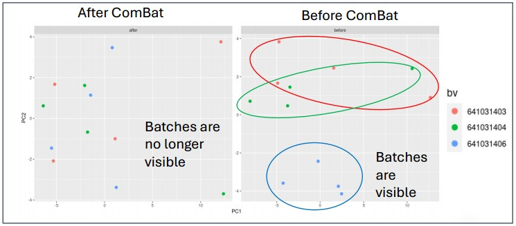

## Should the QC Thresholds Be Adjusted?

**PTK** `fractionPresent` and **STK** `qc_stk_thr.ratio`:

- Default threshold = **0.25**, allowing for peptides to be missing in max 1 condition if there are 4 conditions.
- Inspect data and adjust threshold if appropriate:
  - More than 4 conditions?
  - Only few peptides passing QC?
  - Experiment design indicates adjustment (e.g. if inhibitors are very potent, peptides might be present only in the control condition).

---

## Log or VSN?

As default, **log2 transformation** is used, since VSN transforms the data in a way that fold change directions are harder to interpret.

### Scenario 1 - Try VSN if there is no significant differential effect with log.

After log2, if there is no differential signal between Test and Control conditions, and especially when the signal is overall low, VSN could work better. The reason can be the presence of differential low signal peptides which have a greater chance to be significant in VSN than in log2 data. 

**Assess by:**
- Comparing the number of significant phosphosites and kinases after log and VSN
- PCA plot after log and VSN

→ If there are more significant phosphosites or kinases after VSN than log2, and / or conditions cluster better in PCA, we can conclude that VSN works better for the given data.

**Interpretation:** the kinase directions (fold changes) are relative to the data mean.

### Scenario 2 — Global up/down shift with log which conflicts what we know 

For example, we observe global upregulation. However, other experiments (e.g. Western blot) have already shown that some kinases are downregulated. The observed global shift might be due to an overactive kinase family masking the real effects - downregulated kinases couldn't be detected. 

→ VSN results in kinases that are down relative to the mean.
→ **Can we interpret this as downregulated kinases in the sample?** Assess:
- Whether downregulated kinases follow expectations (e.g. among them is the kinase the regulation of which has been shown - or other kinases which map to the same pathway as the kinase in question.)
- Whether downregulated kinases have a high specificity score.

**Interpretation:**
- VSN shows kinase changes relative to the data mean.
- If kinases follow expectations and have a high specificity score, the hypothesis was probably correct — we can consider those kinases as probably downregulated in the sample.
- If downregulated kinases are scattered and have a low specificity score, this is likely a normalization artifact. Other hypotheses should be considered for why PamGene experiments resulted in global upregulation.

---
## Limma with / without pairing?

| Type of pairing        | Description                                                                                                              | Paired / unpaired analysis?                                                                                                   |
| ---------------------- | ------------------------------------------------------------------------------------------------------------------------ | ----------------------------------------------------------------------------------------------------------------------------- |
| **Biological pairing** | Control and Test are from the same replicate (e.g. same cell line). Pairing factor is typically `barcode` (= Replicate). | **Paired analysis** is better than unpaired— it is more powerful and sensitive because it accounts for technical variability. |
| **Technical pairing**  | Comparing cell line 1 to cell line 2 on the same chip.                                                                   | **Unpaired analysis.**                                                                                                        |
   

---
## Do Limma before or after batch correction? 

**Phosphosite analysis should generally be done on log / VSN data, not on ComBat-corrected data.**

- ComBat corrects by estimating the mean, which removes a degree of freedom from the dataset.
- In limma, this lost degree of freedom cannot be accounted for.
- This leads to inflated significance (more false positives).

**Exception:** When there are many replicates (e.g. 2 runs × 6 replicates), and / or no pairing can be done, and the batch effect is large, ComBat is acceptable. But stricter significance thresholds must be set (e.g. P < 0.001, or set FDR threshold).

---
## Limma Decisions

```
Is there biological pairing?
│
├── Yes → Paired Limma
│
└── No → Is there batch effect?
         │
         ├── Yes → ComBat → Unpaired Limma
         │                  (set stricter significance threshold)
         └── No  → Unpaired Limma
```

**Checking for batch effect:**
- Use PCA, color on batches, and observe clustering of technical batches.
- **1-run experiments:** batch effect may be on Barcode.
- **Multi-run experiments:** check batch effect on Run first (usually larger than Barcode effect). Correcting for too many batch types can introduce bias — if a Run effect exists, correcting for Barcode as well is usually not necessary.

---

## UKA before or after batch correction?

In UKA, there is **no pairing option** available.

ComBat should be done for UKA (or for any multivariate analyses such as PCA, class prediction) **only if:**
1. The design is **balanced** (conditions are balanced across technical batches).
2. There is a batch effect **and** ComBat can remove it.

If ComBat cannot remove the batch effect, UKA should be done on log/VSN data.

```
Is there batch effect?
│
├── Yes → ComBat → UKA on log/VSN + ComBat-corrected data
│
└── No  → UKA on log/VSN data
```

**Before/after ComBat PCA example:**


