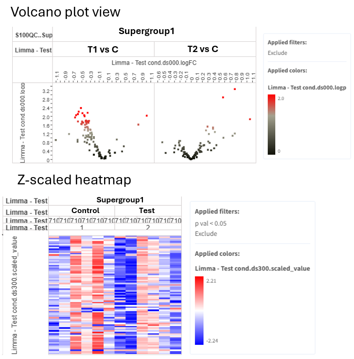
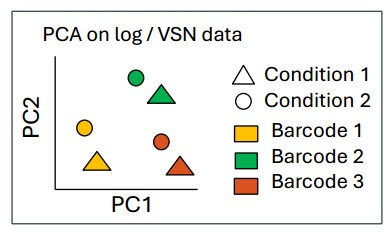
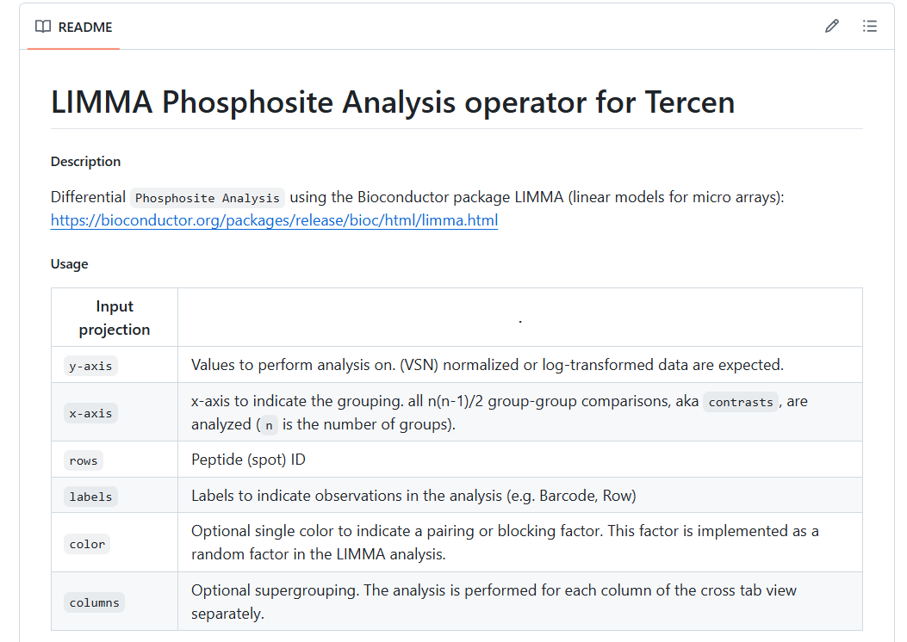

## Overview 

- Phosphosite analysis aims to assess whether there is a difference between Test and Control, and the sign of the difference (activation or inhibition of kinases).
- If the number of differentially phosphorylated phosphosites is
	- High → conclusion: the comparison is biologically relevant.
	- Low → conclusion: consider UKA to be a preliminary or trend analysis that needs further exploration, potentially with increased number of replicates.
- Since peptides map to proteins, this data can be used to infer the regulation of proteins but do this carefully, see “Further insights” section.

The **Limma_app** compares all test and control conditions to each other. Controls are determined by alphabetic or numerical order (e.g. when conditions named as Test and Control, Control serves as control).

Depending on experiment design, 1 or 2 limma runs are needed. The templates contain 2 limma apps after log or VSN normalization: 

- **Limma – Test cond**: compares Test conditions for each Supergroup (e.g. Sg1-Test vs Sg1-Control)
- **Limma – Sgroup**: compares Sg2 to Sg1 for each Test condition (e.g. Sg2-Control vs Sg1-Control)

**LIMMA** (Linear Models for Microarrays):
- Uses information from **all** peptides and conditions to improve analysis (rather than testing each in isolation)
- Increased statistical power over individual t-tests
- Can detect small differences — especially valuable with limited data

**Outputs of limma**: 





**Phosphosite analysis should generally be done on log / VSN data, not on ComBat-corrected data.**

**Why not use ComBat-corrected data?**
- ComBat estimates the mean → the dataset loses a degree of freedom
- Limma cannot account for this → inflated significance (more false positives)

**Exception:** With many replicates (e.g. 2 runs × 6 replicates), ComBat is acceptable if the batch effect is large, but use stricter thresholds (e.g. P < 0.001 or FDR threshold of 0.2).

---
## Limma with / without pairing?

| Type of pairing        | Description                                                                                                              | Paired / unpaired analysis?                                                                                                   |
| ---------------------- | ------------------------------------------------------------------------------------------------------------------------ | ----------------------------------------------------------------------------------------------------------------------------- |
| **Biological pairing** | Control and Test are from the same replicate (e.g. same cell line). Pairing factor is typically `barcode` (= Replicate). | **Paired analysis** is better than unpaired— it is more powerful and sensitive because it accounts for technical variability. |
| **Technical pairing**  | Comparing cell line 1 to cell line 2 on the same chip.                                                                   | **Unpaired analysis.**                                                                                                        |
   

---
## Do Limma before or after batch correction? 

**Phosphosite analysis should generally be done on log / VSN data, not on ComBat-corrected data.**

- ComBat corrects by estimating the mean, which removes a degree of freedom from the dataset.
- In limma, this lost degree of freedom cannot be accounted for.
- This leads to inflated significance (more false positives).

**Exception:** When there are many replicates (e.g. 2 runs × 6 replicates), and / or no pairing can be done, and the batch effect is large, ComBat is acceptable. But stricter significance thresholds must be set (e.g. P < 0.001, or set FDR threshold).

---
## Limma Decisions

```
Is there biological pairing?
│
├── Yes → Paired Limma
│
└── No → Is there batch effect?
         │
         ├── Yes → ComBat → Unpaired Limma
         │                  (set stricter significance threshold)
         └── No  → Unpaired Limma
```

## Interpretation of PamGene Data

| Data type            | Notes                                                                                                                                                             |
| -------------------- | ----------------------------------------------------------------------------------------------------------------------------------------------------------------- |
| **Phosphosite data** | The protein may not be present in the lysate. Phosphorylation can have different outcomes (induction or inhibition). Autophosphorylation sites are very valuable! |
| **Kinase data**      | Main output. Positive FC = activation, negative = inhibition. Many-to-many kinase-phosphosite relationships → use predictions with high specificity scores.       |

 When phosphosite and kinase data overlap, prefer kinase-level data.

---

## Introduction to versioning

PamGene continuously improves data analysis. Each improvement is recorded as a new version of the operator or app. When major improvements are done, the templates are also updated, so the new versions are automatically available.

If you would like to learn about the operator, click on the version number under the operator name in the crosstab view. This takes you to a github page, where the code of the operators and apps are stored.


Operators and apps have a short `README` file which explains how the operator works, how to setup the crosstab view, what are the parameters and outputs.




PamGene data analysis specific operators are found on [PamGene's github](https://github.com/pamgene) and general operators are usually found on [Tercen's github page](https://github.com/tercen).
Find apps, operators and templates with the following pattern on github:  `X_app`, `X_operator`, `X_template`.

Sometimes, previous versions of operators are also available from the library, but in general, the newest versions should be used. 
