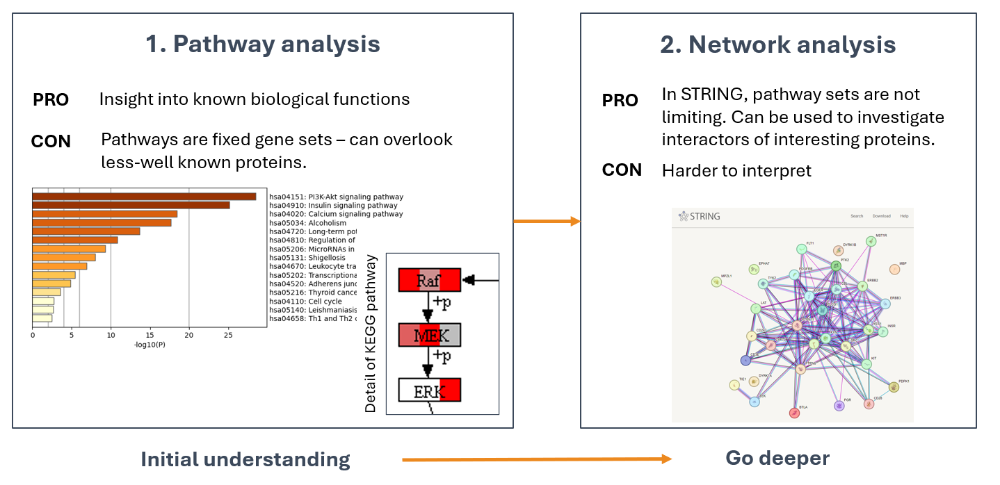
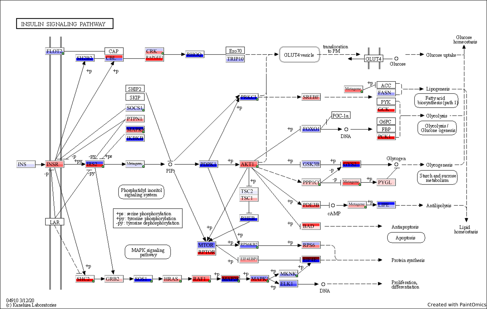
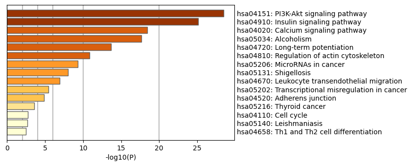

## The interpretation of PamDx Data

|                | Kinase data                                                                                                                | Phosphosite data                                                                                                                                                                                                                                                                                                                                                                                                                                                                                                                                                                                          |
| -------------- | -------------------------------------------------------------------------------------------------------------------------- | --------------------------------------------------------------------------------------------------------------------------------------------------------------------------------------------------------------------------------------------------------------------------------------------------------------------------------------------------------------------------------------------------------------------------------------------------------------------------------------------------------------------------------------------------------------------------------------------------------- |
| **Strength**   | Easy interpretation: positive FC = activation, negative = inhibition. Differential activity has  statistical underpinning. | Autophosphorylation sites are valuable.                                                                                                                                                                                                                                                                                                                                                                                                                                                                                                                                                                   |
| **Key caveat** | Kinases are predicted. Therefore, you must pre-select kinases with high scores (specificity score at least > 0.7).         | Interpreting peptide signal = protein signal is a big simplification, because the peptide signal is the sum of phosphorylation by different kinases on a 13mer peptide on the PamChip. Further: 1. The protein  may not be present in lysate. 2. Phosphorylation can have different outcomes (induction or inhibition of protein or other functions).   3. Matching a single peptide to a protein is statistically not as strong as kinases. Kinases can only be predicted if at least 3 phosphosites show consistent change. If you decide to interpret it this way, mention this caveat. |

**Example: Phosphosites with different functions:**

| ID           | PSite | Residue | Function                                                |
| ------------ | ----- | ------- | ------------------------------------------------------- |
| AKT1_301_313 | 308   | T       | required for full activity                              |
| AKT1_170_182 | 176   | Y       | phosphorylation by TNK2 tethers AKT1 to plasma membrane |

---

## Pathway and Network Analysis Are Complementary

---

## Pathway Analysis Tools

**Choose:**

* Pathway sets (e.g. KEGG, Reactome, WikiPathways, GO)

- Type of analysis:

	- Functional Class Scoring (e.g. GSEA)
	
	- Overrepresentation Analysis (e.g. EnrichR)

**Pathway analysis types**

| Overrepresentation (e.g. Metascape)                                                                                                                                                                         | Functional class scoring (e.g. GSEA)                                                                                                                                                                |
| ----------------------------------------------------------------------------------------------------------------------------------------------------------------------------------------------------------- | --------------------------------------------------------------------------------------------------------------------------------------------------------------------------------------------------- |
| **TLDR**: More true positive, more false positive results.  Tests whether the overlap of pathway members in the data is higher than by chance.  Input: list of significant features (no values) | **TLDR**: Less false positive, less true positive results.  Detects pathways based on subtle, coordinated changes in pathway members.  Input: actual values of features or Fold Change. |
| **Pro**: easy to use.                                                                                                                                                                                       | **Pro**: Can sensitively detect subtle, coordinated changes in pathway members. Pathway output is more reliable.                                                                                    |
| **Con**: Pre-filtering of features can introduce bias: 1) subtler changes might not be significant; 2) multiple testing bias (inflation of false positives)                                                 | **Con**: Can overlook pathways if members don’t show clear up-or downregulation.                                                                                                                    |

**Online tools:** Metascape, EnrichR, gProfiler, Paintomics (overrepresentation analysis)

**R packages:** GSEA (gage, clusterProfiler), Pathview

**Paintomics output**: KEGG pathways colored by LFC (of 1+ comparisons)

**Metascape output: top pathways:**

---

## Suggestions for validating results

Select kinases that **consistently appear with high Specificity Score** in experiments with ≥ 3 replicates/condition (cell lines) or ≥ 6 replicates/condition (primary cell cultures / patient samples).

**We recommend validating kinases over phosphosites** because:

- Targets may not be in their native form in the lysate
 
- Phosphorylation at a site can have different functional outcomes

**Western blot validation strategy:**

- **Upregulated kinase**: use antibodies specific for phosphosites that **induce** kinase activity

- **Downregulated kinase**: use antibodies specific for phosphosites that **inhibit** kinase activity

Use Uniprot and PhosphoSitePlus to identify relevant phosphosites. PamGene can also help identify relevant phosphosites on request.

If direct kinase validation is not possible, validate **downstream phosphosites** activated by the kinase (PamGene can assist on request).

---

## Questions?

For questions about experiment design, data analysis, validation, or anything else:

📧 **support@pamgene.com**
