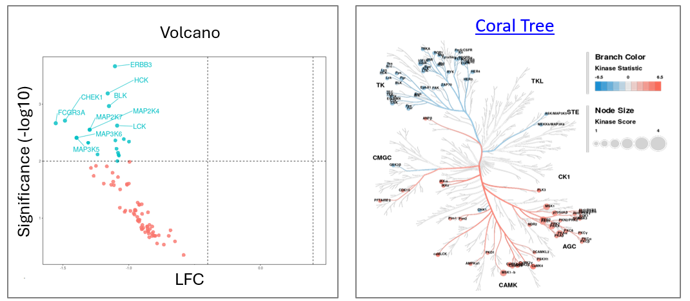
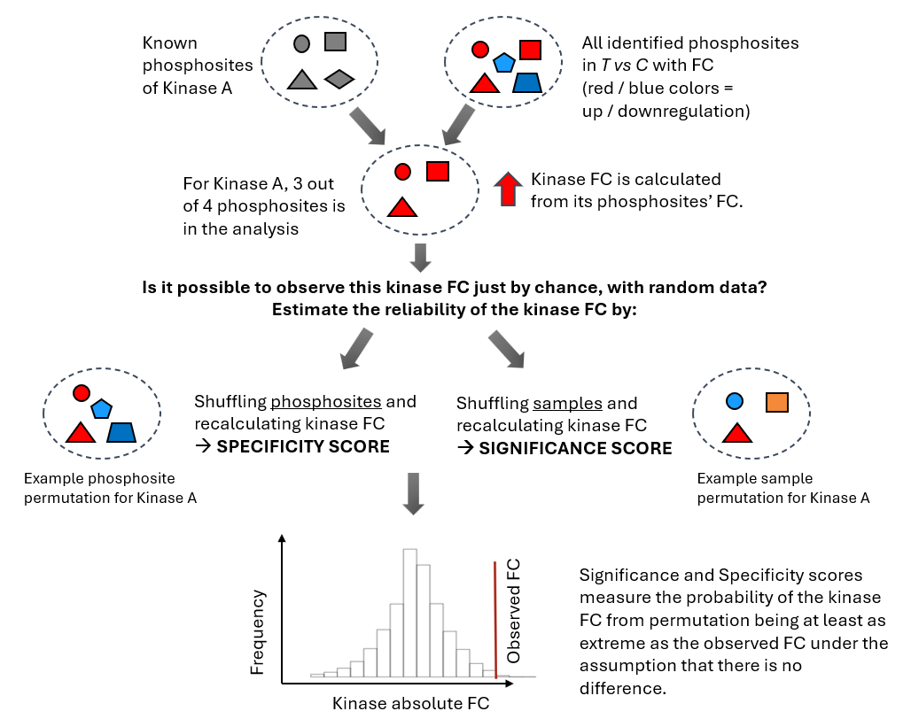
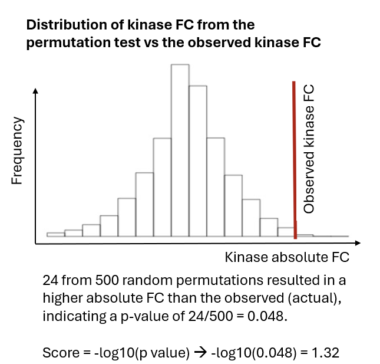
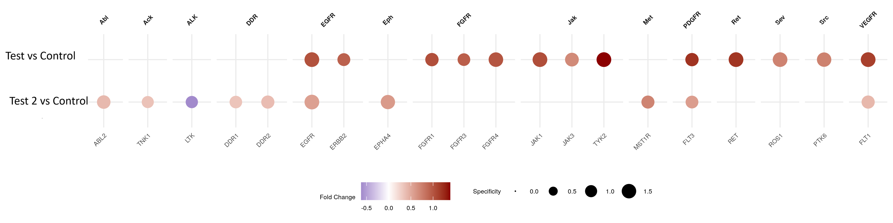
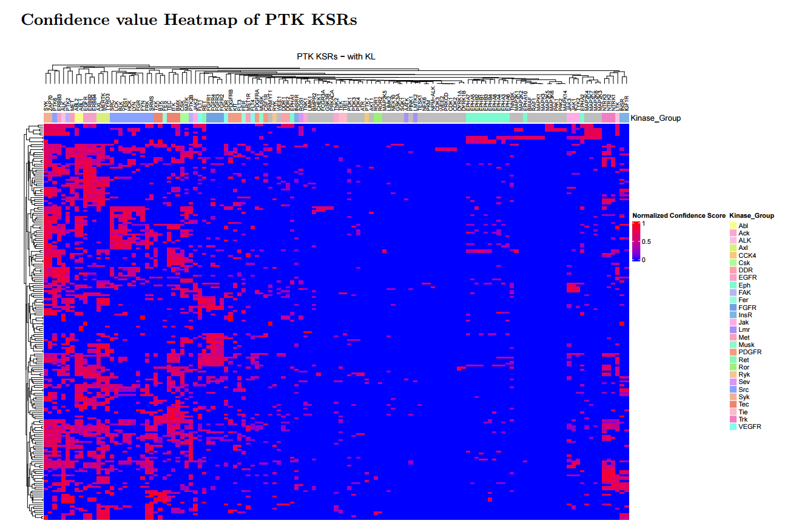
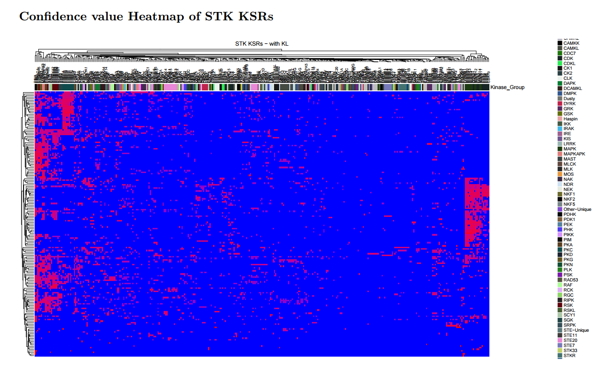
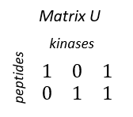
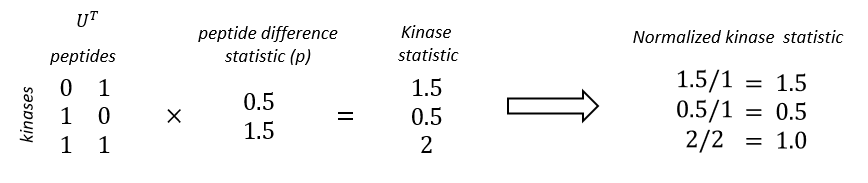

## Introduction to Upstream Kinase Analysis 

Kinase prediction (Upstream Kinase Analysis, UKA) is the main output of PamGene analysis.

The UKA relies on public databases of kinase–to–phosphosite relationships.

UKA is a **functional class scoring method**: it predicts kinase activity by analyzing changes in the sets of phosphosites belonging to each kinase.* Scores indicate how strongly a kinase is associated with the observed changes in peptide signal.

The UKA is run on **all peptides after QC** — not only significant peptides.

**Output**: kinases changed between two conditions (T vs C): **LFC & Significance**

**Visualizations**:
* Dotplot (see below)
* Volcano
* [Coral Tree](http://phanstiel-lab.med.unc.edu/CORAL/)

\* Another functional class scoring method is GSEA, Gene Set Enrichment Analysis. For GSEA, a pathway is considered a functional class of members - in UKA, a kinase is considered as a functional class of phosphosites.

---

### The UKA Algorithm in a Nutshell

1. Calculate **Kinase FC** from the FCs of its phosphosites.
2. **Significance score**: permute samples 500 times and recalculate kinase FC. This gives the probability that the observed kinase FC could not have been obtained from random samples. This tells: _“Is this kinase signal reliably different?”_
3. **Specificity score**: permute phosphosites and recalculate kinase FC. This gives the probability that the observed FC could not have been obtained from a random peptide set. This tells: _“Is this kinase specifically responsible for these phosphorylation changes?”
4. **Final score** = Significance Score + Specificity Score

| Score            | Permutation  | High score means                                                                                                  | Comments                                                                                                                                                                                                                                                                                                                                                                                                                                |
| ---------------- | ------------ | ----------------------------------------------------------------------------------------------------------------- | --------------------------------------------------------------------------------------------------------------------------------------------------------------------------------------------------------------------------------------------------------------------------------------------------------------------------------------------------------------------------------------------------------------------------------------- |
| **Significance** | Samples      | High probability that the kinase FC is not due to sample noise.                                                      | Can be biased toward **promiscuous kinases** or abundant activity. With a limited number of replicates (such as n=3), the statistical power is relatively low, which can make the significance score less robust and more prone to variability. In addition, it tends to favour kinases that act on many substrates. These “hub” kinases (like MAPKs or CDKs) often rank highly simply because they affect a large number of peptides.. |
| **Specificity**  | Phosphosites | High probability that the kinase FC is not due to a random peptide set. Accounts for overlap of substrates between kinases | **This is the most important score.** It helps identify kinases whose activity is more likely to _specifically explain_ the data, rather than those that are broadly active.                                                                                                                                                                                                                                                                |

**Permutation Test Results**

----
### The UKA dotplot

The Kinase dotplots show the specificity and Fold Change of the significant kinases in different comparisons. Larger dots indicate higher specificity. The kinases are clustered by families.

---
### The UKA Table

**Most important columns:**

| Sgroup_contrast | Kinase Name | Median Kinase Statistic | Mean Significance Score | Mean Specificity Score | Median Final Score |
| --------------- | ----------- | ----------------------- | ----------------------- | ---------------------- | ------------------ |
| Sgroup1_T vs C  | ROR1        | 1.06                    | 0.97                    | 1.34                   | 2.31               |
| Sgroup1_T vs C  | MAP2K3      | 0.77                    | 0.52                    | 1.01                   | 1.53               |
| Sgroup1_T vs C  | MAP2K6      | 0.77                    | 0.52                    | 1.01                   | 1.53               |

**Usage:**

- **Use the Kinase Statistic as a proxy for LFC between T vs C.** 
	- < 0 means inhibition, > 0 means activation.
	- The Kinase statistic is signal-to-noise ratio: the LFC scaled by noise. This is more relevant than simple LFC for predicted data. (Median Kinase Change is the actual LFC.)

- To find significant results, set a cutoff on **Specificity Score**. We suggest > 1 (p<0.1) or 1.3 (p<0.05)

- If you are using the UKA algorithm, scores are Mean or Median because the algorithm considers multiple peptide sets per kinase (of varying size based on interaction strength). In the confidence scoring UKA algorithm, there are no Mean and Median scores. 

**Additional columns:**

| Kinase Name | Median Kinase Change | Mean Peptide Set Size |
| ----------- | -------------------- | --------------------- |
| ROR1        | 0.25                 | 3                     |
| MAP2K3      | 0.34                 | 5                     |
- Kinases with **small peptide sets** are usually more specific

---
### UKA Scores — Detailed Definitions

| Score                          | Definition                                                                                                                                                                        |
| ------------------------------ | --------------------------------------------------------------------------------------------------------------------------------------------------------------------------------- |
| **Kinase Statistic**           | Direction of effect: change in kinase activity in T vs C.  Calculated as the median of Peptide Statistics (signal-to-noise ratio between T and C) of the kinase's peptide set. |
| **Significance Score**         | Based on a sample-permutation test. High score = high probability of differential activity between T and C.                                                                       |
| **Specificity Score**          | Based on a peptide-permutation test. High score = high probability the effect was not obtained by a random peptide set.                                                           |
| **Kinase Score (Final Score)** | Significance Score + Specificity Score                                                                                                                                            |

---
### Two ways of doing UKA 

* UKA algorithm (legacy, deprecated but supported)
* Confidence scoring UKA algorithm (csUKA): Confidence scoring is a newer algorithm compared to the UKA algorithm. The outputs of UKA and csUKA are equivalent with the same set of UKA databases, but csUKA has practical benefits. 
#### csUKA and legacy UKA outputs are equivalent.

Text to be added.

---
## Detailed steps of the (cs) UKA algorithm

### Step 1. Calculation of the  Peptide Difference Statistic

  This step is done in the same way between csUKA and UKA.

The Peptide Difference Statistic (Peptide Statistic) is calculated for each peptide comparing two conditions, using the $\log_{2}$ kinase activity profiles measured on the chips.

  

The Peptide Statistic is the Signal to Noise Ratio (SNR) of the difference between the $\log_{2}$ kinase activity profiles.

  
$$\mathbf{p =}\frac{\overline{\mathbf{x}_{\mathbf{T}}}\mathbf{- \ }\overline{\mathbf{x}_{\mathbf{C = 0}}}}{\sqrt{\mathbf{\sigma}_{\mathbf{T}}^{\mathbf{2}}\mathbf{+}\mathbf{\sigma}_{\mathbf{C}}^{\mathbf{2}}}}$$

  
where $p$ = Peptide Statistic, $\overline{x}$ = mean $\log_{2}\$kinase activity of $T$ (Test) or $C$ (Control) conditions, $\sqrt{\sigma^{2}}$ = standard deviation of kinase activity of the two conditions.

A similar value that describes the peptide difference is the Peptide Change:

$$\mathbf{p}_{\mathbf{change}}\mathbf{=}\overline{\mathbf{x}_{\mathbf{T}}}\mathbf{- \ }\overline{\mathbf{x}_{\mathbf{C = 0}}}$$

This is used to calculate the Kinase Change (see later).

### Step 2.  Construction of the UKAdb from public kinase-to-substrate databases

The main differences between csUKA and legacy UKA lie in how the UKAdb is constructed. 

* Kinase-to-substrate data from public databases such as PhosphoNet and Kinase Library (KL) contain Kinase Ranks. The Kinase rank is, for each substrate (peptide), the rank of the phosphorylating kinase based on the likelihood of phosphorylation. Lower ranks mean that the kinase is more likely to phosphorylate the peptide. Ranks from 0-12 are used.
* From the data, Kinase-to-Substrate matrices are constructed in different ways.
	* **The legacy UKA** constructs multiple matrices based on Kinase Rank thresholds. Thus for each kinase, multiple peptide sets are considered – by decreasing the stringency of the cutoff, the size of the peptide set increases. The basic set includes the peptides of ranks 0 to 4 and subsequent peptide sets are formed by including the lower ranks from 5 to 12, one-by-one.
	* **The confidence scoring UKA** constructs only 1 matrix. It synthetizes information using all Kinase Ranks in a transparent way. Additional to the legacy UKA, it does a correction for peptide specificity.
* The UKA algorithm combines the Kinase-to-Substrate matrix and the observed peptide signal to calculate the Kinase fold change and its significance (specificity and significance scores). The legacy UKA does this for each data matrix, and takes the mean / median of these scores (e.g. Mean Specificity Score).

**csUKA has the following advantages:**

- Central *part under the hood* is a Kinase-to-Substrate matrix with confidence values. The assignment of these confidence values is straightforward, transparent, and may be discussed based on a researchers' assessment of phosphorylation databases.
* It is straightforward to extend the approach to additional databases.
* Faster computation than legacy UKA, as no rank scanning is done.

#### Confidence values for kinase-to-peptide relations

1. **Assign confidence values**

First step is to assign probability-like confidence values $p$ to kinase to substrate relations (KSR) based on entries found in various PTM databases. I.e. these values are assigned based on our belief about what a database entry means for the probability of a kinase phosphorylating a certain peptide on our chip.

The following confidence values are used:

| Database          | Rank | p         |
| ----------------- | ---- | --------- |
| in vitro, in vivo | 0    | 0.90      |
| PhosphoNET        | 1–4  | 0.90      |
| PhosphoNET        | 4–8  | 0.75      |
| PhosphoNET        | 9–12 | 0.50      |
| Kinase Library    | 1–12 | 0 or 0.30 |

KSR's that are not found in any of the databases: $p_0$ = 0.

Note that this is open to discussion based on biological arguments, and easy to extent to additional databases and types of databases.

2. **Confidence values are combined, since a single KSR may appear in multiple databases.**

  For each KSR we may therefore obtain 1 to N confidence values: $p1, p2, ..., pN$.

  These are combined into a single confidence value $p_c$ using:

  $1-p_c = min[1-p_0, \prod_{n=1}^{N}(1-p_n)]$

  Equivalently:

  $p_c = 1 - min[ 1 - p_0, (1 - p_1)(1 - p_2)...(1 - p_N) ]$

  This formulation treats different database entries as independent evidence and caps the combined confidence by the prior uncertainty defined by $p_0$.

  E.g. if a KSR appears in a in vivo/ in vitro database *and* with rank 6 in the PhosphoNET database, the combined confidence value is:

$p_c = 1 - min[1-0, (1-0.9)(1-0.75)] = 0.975$

3. **Normalization for Peptide Specificity.**

Assume an experiment with P peptides mapping to K kinases.

  We construct a P x K matrix M, where rows correspond to peptides, columns correspond to kinases and entries contain the combined confidence values $p_c$.

  We take the *specificity* of a peptide into account by normalizing each KSR using the probability that a given peptide is phosphorylated by any of the included kinases.

  Hence, for the elements of M we have (dropping the subscript $c$ of $p_c$ for clarity):

  $m_{ij} = \displaystyle \frac{p_{ij}}{\sum_{h=1}^K p_{ih}}$

  
, each element of M normalized using the corresponding row sum of M.

  **Relation to Bayesian stats**

This formulation is motivated by Bayes’ rule. Let:

  
$p(k | s)$ be the probability that kinase k has changed activity, given that substrate s has changed phosphorylation.

  
Bayes’ rule gives:

  
$p(k|s) = \displaystyle \frac{p(s|k)}{\sum p(s|k)}.p(s)$

  
Hence, matrix M elements $m_{ij}$ correspond to the normalized prior of the KSR between peptide i and kinase j. The matrix represents the prior belief in KSRs.

  **Summary**

The peptide–kinase confidence matrix provides a biologically interpretable way to relate peptides to upstream kinases. It combines evidence from multiple databases, accounts for peptide specificity, and has a clear Bayesian interpretation, making it a generic and extensible tool for kinase activity analysis.

  

#### Construction of the UKAdb in legacy UKA. 

The kinase-to-peptide matrix, $U$, is binarized where zeroes represent no connection between peptides and Upstream Kinases and ones represent a connection.

  

  

There is a connection (a peptide is enriched with an UK) if:

  

- the peptide has a match to a phosphosite for which the UK is found in an in *vivo / in vitro* database (Kinase rank designated as 0).

  

- the peptide has a match to a phosphosite for which the UK has a PhosphoNET (*in silico* database) 'Kinase Predictor V2 Score' \> 300 and a rank less than or equal to a cut-off (see in the next section).

  

3.  **For each kinase, different size of peptide sets are considered**

  

In each analysis, multiple $U$ matrices are calculated based on varying the Kinase rank cutoff. Thus for each kinase, multiple peptide sets are considered -- by decreasing the stringency of the cutoff, the size of the peptide set increases. The basic set includes the peptides of ranks 0 to 4 and subsequent peptide sets are formed by including the lower ranks from 5 to 12, one-by-one.

### Step 3: Calculation of The Kinase Statistic and the Kinase Change

  The Kinase Statistic represents the direction of effect: the change in kinase activity in a Test condition (T) compared to a Control condition (C). \< 0 means inhibition, \> 0 means activation in T versus C. 
  
  The Kinase Statistic is the median of the Peptide Statistics of the set of peptides that a kinase can phosphorylate. Thus, the Kinase Statistic represents the log fold change scaled by the noise.

  For each $U$  matrix (for each peptide set per kinase), the normalized Kinase Statistic is calculated:
  

$\mathbf{s = b\ *}\left( \mathbf{U}^{\mathbf{T}}\mathbf{p} \right)$

  

$\mathbf{b}_{\mathbf{i}}\mathbf{= 1/}\mathbf{a}_{\mathbf{i}}$, where

  

$\mathbf{s}$: the Kinase Statistic is the weighted average of $\mathbf{p}$, the peptide difference statistic. $\mathbf{b}$ is a normalization vector, $\mathbf{a}_{\mathbf{i}}$ is the number of nonzero elements in column $i$ of $U$ (the number of peptides that a kinase phosphorylates).

  

 
An example calculation:
{width="6.3in" height="1.3284722222222223in"}

  

Formulated in a different way: for kinase i,

  

$$s_{i} = \ \frac{1}{a_{i}}*\sum_{j = 1}^{k}p_{j}$$

  

For each peptide set considered for a kinase, the Kinase Statistic is calculated, and in the results, the Median Kinase Statistic across different peptide sets is given.

  

The **Kinase Change** is calculated similarly as the Kinase Statistic, but using the $p_{change}$ values:

  

$$\mathbf{s}_{\mathbf{MKC}}\mathbf{= b\ *}\left( \mathbf{U}^{\mathbf{T}}\mathbf{p}_{\mathbf{change}} \right)$$

  

The Kinase Statistic, in contrast to Kinase Change, is a value that also describes the significance of the change, i.e. whether the change is higher than the noise.

  
### Step 4. Calculation of Significance and Specificity scores

**Significance score**: permute samples 500 times and recalculate kinase FC. This gives the probability that the observed kinase FC could not have been obtained from random samples. This tells: _“Is this kinase signal reliably different?”_

 *Specificity score**: permute phosphosites and recalculate kinase FC. This gives the probability that the observed FC could not have been obtained from a random peptide set. This tells: _“Is this kinase specifically responsible for these phosphorylation changes?”

**Final score** = Significance Score + Specificity Score

For legacy UKA, mean and median scores are calculated across the different peptide sets (different U matrices) considered for a kinase. For further analysis, the Median Kinase Statistic and Median Final Score are used.