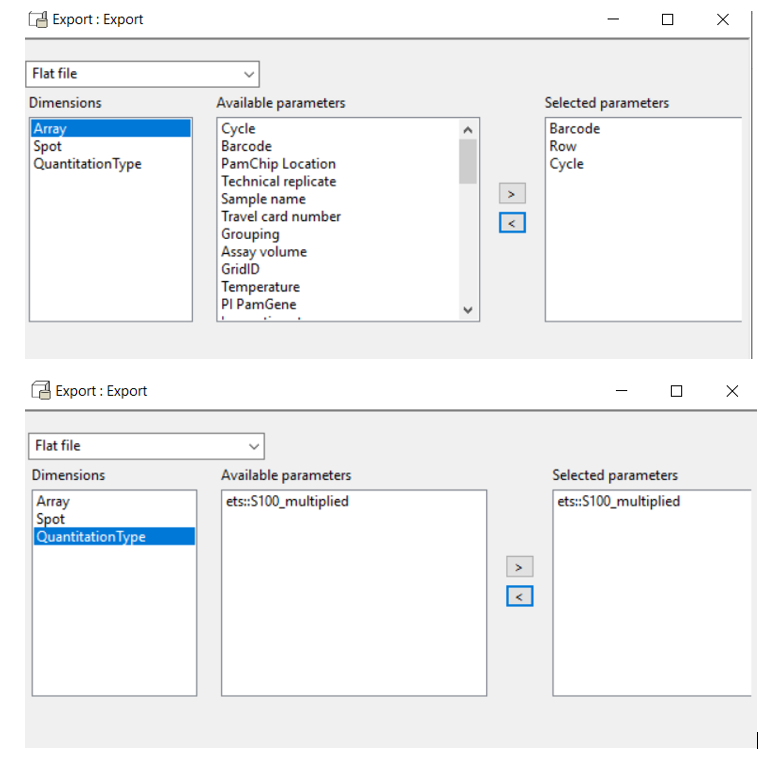
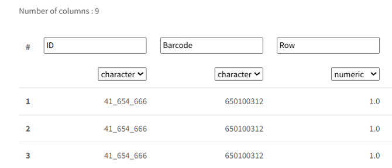

## How to bring data from BioNavigator to Tercen

How to bring data from old Bionavigator (.bn6 workflows) into Tercen:

1. After ETS, add export step
	1. Export type: Flat file
	2. From array, export: Barcode, Row, Cycle
	3. From Spot, export: ID
	4. From QuantitationType, export:ets::S100_multiplied

2. Open this output in notepad or Notepad++ (not in Excel) and change the name of factors:
	1. ets::S100_multiplied --> ETS.ds1.S100.
	2. Cycle --> ETS.ds1..Cycle. (be aware of the number of dots!)  
This is done to have the same names as the result of ETS in Tercen, because these names are default in the next QC step.

3. Bring this data in Tercen:
	1. Import data --> Delimited text --> change barcode to character, row should remain numeric, and check whether all column types are correct
	2. Make a new data analysis template (PTK_template or STK_template, where you add this file instead of the image analysis output file.
	3. Next, join the data with the enrichment file using the join step. Joining is done on Barcode and Row, but the exact factor names in the bn6 export files are different (only Barcode and Row, not ds1.Barcode and ds1.Row).
	4. Delete the ETS step and join this directly to the QC step.

